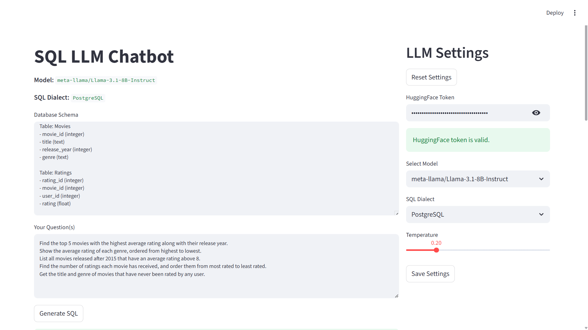
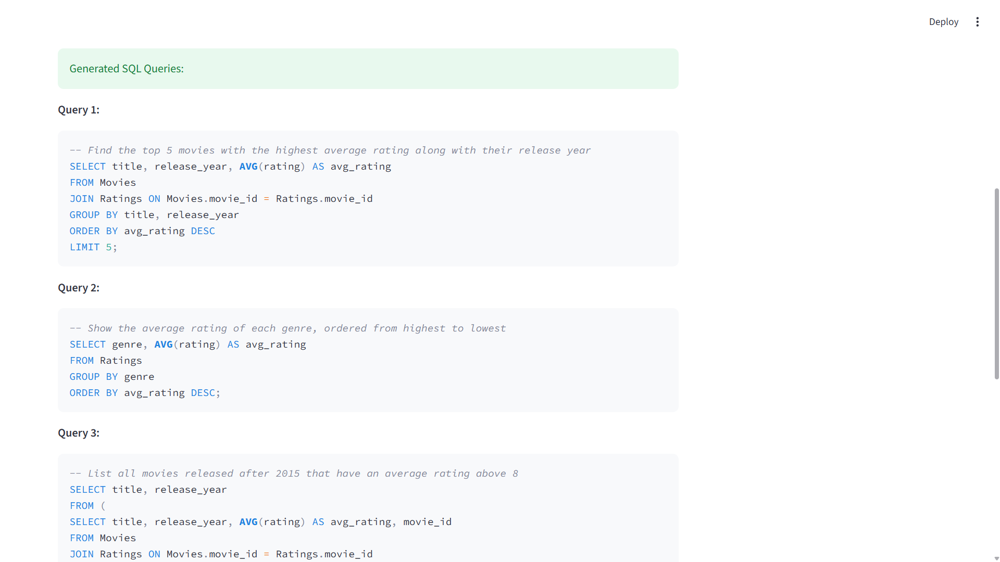

# SQL LLM Chatbot

A web application that generates SQL queries from natural language questions using Large Language Models (LLMs).  
Built with **FastAPI** (backend) and **Streamlit** (frontend), powered by **HuggingFace models**.

---

## Features

- Generate accurate SQL queries from natural language questions.
- Support for multiple SQL dialects: PostgreSQL, MySQL, SQLite.
- Easy-to-use web interface with Streamlit.
- Save and load HuggingFace tokens and model settings.
- Lightweight FastAPI backend for inference.

---
## Project Preview

---
## Project Structure

```
sql_llm_chatbot/
│
├── assets/
│ ├── Frontend.png         # Frontend UI img
│ └── Output.png           # Output img
│
├── backend/
│ ├── llm_handler.py       # LLM integration
│ └── sql_utils.py         # SQL cleaning utilities
│
├── frontend/
│ ├── main.py              # Streamlit frontend
│ └── tabs/
│   └── llm_settings.py    # Settings panel for model, token, temperature
│
├── api.py                 # FastAPI backend
├── requirements.txt       # Python dependencies
└── test_llm.py            # Testing llm_handler
```

---

## Setup Instructions

### 1. Clone the repository
```bash
git clone <repository_url>
cd sql_llm_chatbot
```
### 2. Install dependencies
```bash
pip install -r requirements.txt
```

### 3. Run the backend (FastAPI)
```bash
uvicorn api:app --reload
```
- Backend runs at: http://127.0.0.1:8000

### 4. Run the frontend (Streamlit)
In a new terminal:
```bash
streamlit run frontend/main.py
```

- Opens the app in your default browser.
- Make sure the FastAPI backend is running before generating SQL.

---

## Usage

- Open the Streamlit app.
- Go to LLM Settings on the right panel:
  - Enter your HuggingFace API token.
  - Select model and SQL dialect.
  - Adjust temperature if needed.
  - Save settings.
- Enter your Database Schema and Natural Language Question.
- Click Generate SQL to get the query.
- Copy and use the generated SQL in your database.

---

## Requirements

- Python 3.9+
- HuggingFace account and API token
- Internet connection (for model inference)

---

## Example

### Schema:
```text
Table: Movies
- movie_id (integer)
- title (text)
- release_year (integer)
- genre (text)

Table: Ratings
- rating_id (integer)
- movie_id (integer)
- user_id (integer)
- rating (float)
```


### Question:
```text
Find the top 5 movies with the highest average rating along with their release year.
Show the average rating of each genre, ordered from highest to lowest.
List all movies released after 2015 that have an average rating above 8.
Find the number of ratings each movie has received, and order them from most rated to least rated.
Get the title and genre of movies that have never been rated by any user.
```


### Generated SQL:
 

---
## Live Demo
- **Streamlit Frontend:** [https://sqlllmchatbot.streamlit.app](https://sqlllmchatbot.streamlit.app)
- **FastAPI Backend:** [https://sql-llm-chatbot.onrender.com](https://sql-llm-chatbot.onrender.com)

---

## Notes

- Only columns and tables from the provided schema are used.
- The app currently supports a single model, but other HuggingFace models can be added.
- Keep your HuggingFace token secret and never share it publicly.

---

## Author
 **Created by AY**
